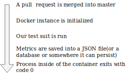

# Front End Development Automation with Puppeteer. Part 4

## Intro

<!-- Hi everyone, sorry for taking so long to write this post. I'm developing a open source SaaS product out of these blog posts and figuring what the next logical step could be was not that easy for me. -->

In this post **we will create part of a system that is part of a bigger one**. We will focus only on running performance test.

**Note**: In this post I am assuming that you are quite familiar with Git, [Github Webhooks](https://dev.to/papaponmx/a-gentle-explanation-of-github-webhooks-----d3e), [NodeJS](https://nodejs.org) and Docker.

## The problem

> ABC Corp has a `SPA` that is core to the business. It needs to perform great on mobile(we will define what great means later). As time goes by, releases become more frequent and there is a pressing need **to ensure that all new releases comply with the `performance budget` assigned to it**

## The solution

As developers, we must ensure each release must be in a deployable state. For us, deployable means that all tests are passing and new features work as expected in an production-like environment. On top of that, we need/would like to have a way to get instant feedback about the performance of our next release, there for the proposed solution:

> Create a system that runs performance tests each time a new release is made.

## Application outline

Here is what our application will do:



<!-- Our solution will be a NodeJS application that does the foi:

1. **Listen to relevant event using Github actions**. We can acomplish this using [Github Actions](https://developer.github.com/actions/).
2. **Run performance tests**. Once the request is recieved, an audit will run within a Docker container.
3. **Generate a report**. I'll design this an develop it in another post.
4. **Put a link on the README.md**. I'll design this an develop it in another post. -->

## Dependencies

* [dotenv](https://www.npmjs.com/package/dotenv). A zero-dependency module that loads environment variables from a `.env` file into `process.env`
* [NodeJS](https://nodejs.org).
* [Puppeteer](https://github.com/GoogleChrome/puppeteer). Headless Chrome Node API.
<!-- * [ShellJS](https://github.com/shelljs/shelljs). Unix shell commands on top of the Node.js API -->
* [Lightouse CLI](https://developers.google.com/web/tools/lighthouse/#cli). Audit our application and get the relevant data.


## 1. Developing our Analysis tool

Ideally, our next build should always either improve upon the last release or stay within an acceptable range. If things start to deviate, we want to get the relevant data as fast as posible.

We will create a function that gathers these metrics:

* JS Coverage & CSS Coverage. This metric tells us how much code was used, versus how much was loaded.
* Network Requests. Lists the network requests that were made during page load.
* Speed-index. Speed Index shows how quickly the contents of a page are visibly populated.

We will runs all tests that Lighthouse has available. This is the order in which things should start to happen:

1. **Get the app URL running in a testing/staging/local environment**. This should be read from a configuration file.
2. **Generate code coverage**. For now we'll just get it for the home page.
3. **Run Lighthouse audit**.
4. **Filter information and send it somewhere it can persist.** This could be either a JSON saved using file system or a Database. As the app matures we'll define it somewhere else


```javascript
/**
 * perfAudits.js
*/

'use strict';
require('dotenv').config();

const chromeLauncher = require( 'lighthouse/chrome-launcher/chrome-launcher' );
const fs = require( 'fs' );
const lighthouse = require( 'lighthouse' );


const { APP_URL } = proccess.env;
// 1.

const launchChromeAndRunLighthouse = ( url, flags, config = null ) => {
  return chromeLauncher.launch()
    .then( chrome => {
      flags.port = chrome.port;
      return lighthouse( url, flags, config )
        .then( results =>
          chrome.kill()
          .then( () => results )
        );
    } );
}

const flags = {
  output: 'json'
};

// 2.
launchChromeAndRunLighthouse( APP_URL, flags )
// 3.
  .then( results => {
     fs.writeFile( './result.json', JSON.stringify(results), function ( err ) {
        if ( err ) {
          return console.log( err );
        }
        console.log( 'The file was saved!' );
      } );
});

```

Note that the `results` variable could be sent to a database and be stored for historycal comparison.

In this case, we'll just save it as a JSON file
<!-- ### Running performance tests -->

## 2. Creating our Github Action

**Note**: *At this time, Github actions are in public, beta, so please use this with caution, I'll update this post when the Github actions are officially released*.

Within a [`git-flow`](https://danielkummer.github.io/git-flow-cheatsheet/) context, new releases come from `release` or `hotfix` branches, both of them should point towards. This will be covered in my next blog post.

In order to create our action, first we need to add a `Dockerfile` to the application. This is what it looks like.

```Dockerfile
FROM alpine

```