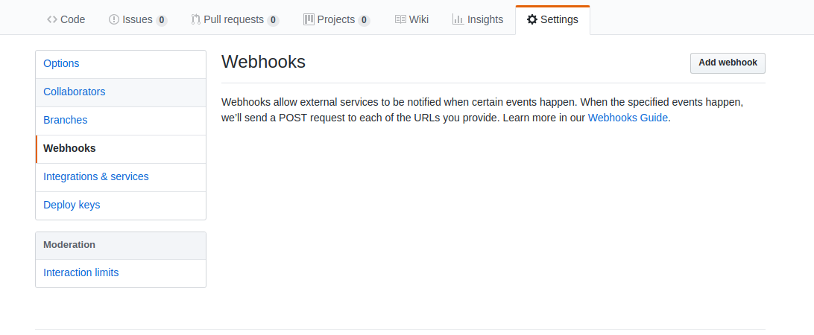

# Intro

As you know, I have been working a lot on puppeteer lately. Trying to automate the things that I find important, repetitive and boring, or where the [Pareto principle](https://en.wikipedia.org/wiki/Pareto_principle) can be implemented. This is an in between post that we'll build on top of for the next part of the project.

The choice to aim for something greater while selecting a topic for this post was not that easy, however, I feel like on the verge of building a product that: is open source, provides you with a lot of value, excites us all and is profitable. All of those four, in that specific order.

If you want to, you can tweet me [@papaponmx](https://twitter.com/papaponmx), DMs are open.

## What are webhooks and why do they matter

In this context, *hooks are events you can subscribe to* in order to trigger some action. It is possible that you have been using them for a while without knowing. Within the context of git and Github, there are many events you might want to know about.

They matter because they allow us to perform some actions only when they are relevant, here are some examples:

* When a pull request is created, run all the tests and let me know if they are OK, or not.
* When a new release tag is created, make a summary of all the new features and add it to the `CHANGELOG.md`.
* When a new issue is rised, send a message to the team via Slack.
* Any time a release is made, run performance test, look for key differences and let me know the results. This is what we are going to do on the next post.

Here is a [link](https://developer.github.com/webhooks/) with more events you can subscribe to.

## How does it work

When some event happens, Github will send you an *HTTP POST* letting you us know that the event happen and *a payload* providing us with relevant information about it. For example: If you subscribed to `pull_request`, they payload will tell us who initiated it, the target and origin branches, etc.

As you can tell, the payload depends on the event, in the `pull_request` payload, we have this information about the repo:

```javascript
{
//...
"repo": {
  "id": 135493233,
  "node_id": "MDEwOlJlcG9zaXRvcnkxMzU0OTMyMzM=",
  "name": "Hello-World",
  "full_name": "Codertocat/Hello-World",
  "owner": {
    "login": "Codertocat",
    "id": 21031067,
    "node_id": "MDQ6VXNlcjIxMDMxMDY3",
    "avatar_url": "https://avatars1.githubusercontent.com/u/21031067?v=4",
    "gravatar_id": "",
    "url": "https://api.github.com/users/Codertocat",
    "html_url": "https://github.com/Codertocat",
    "followers_url": "https://api.github.com/users/Codertocat/followers",
    "following_url": "https://api.github.com/users/Codertocat/following{/other_user}",
    "gists_url": "https://api.github.com/users/Codertocat/gists{/gist_id}",
    "starred_url": "https://api.github.com/users/Codertocat/starred{/owner}{/repo}",
    "subscriptions_url": "https://api.github.com/users/Codertocat/subscriptions",
    "organizations_url": "https://api.github.com/users/Codertocat/orgs",
    "repos_url": "https://api.github.com/users/Codertocat/repos",
    "events_url": "https://api.github.com/users/Codertocat/events{/privacy}",
    "received_events_url": "https://api.github.com/users/Codertocat/received_events",
    "type": "User",
    "site_admin": false
  },
}
```

If you want to check the full JSON for `pull_request`, [here is the link](https://developer.github.com/v3/activity/events/types/#pullrequestevent).

## How do we start

I'm glad you asked. Now that we have a general notion of the basics, we need two things:

1. To register our webhook.
2. Expose an endpoint to our webhook.

### Registering our webhook

On your repository, you need to go to Settings, click the Webhooks tab and you should see a screen like this:



One you click the Add webhook button, you will be asked for the following data:

* **Payload URL**: This is the endpoint where we will receive the post, something like `http://localhost:4567/payload`. But we'll configure this later.
* **Content type**: Comming from a Front End background, `application/json` makes more sense.
* **Secret**: This is a string. The purpose it serves, is to provide us with a way to ensure that the POST request is coming from Github.
* **Events**: The events you want to listen.

This is what a webhook added looks like:


Cheers guys.

### Further resources:

Link to my Puppeteer series:

* [Part 1](https://dev.to/papaponmx/front-end-development-automation-with-puppeteer-part-1-2k9n)
* [Part 2](https://dev.to/papaponmx/front-end-automation-with-puppeteer-part-2-2pmb)
* [Part 3](https://dev.to/papaponmx/front-end-development-automation-with-puppeteer-part-3-3pl6)

[Github webhooks Documentation](https://developer.github.com/webhooks/)
 My twitter profile, [@papaponmx](https://twitter.com/papaponmx).

Cheers guys.